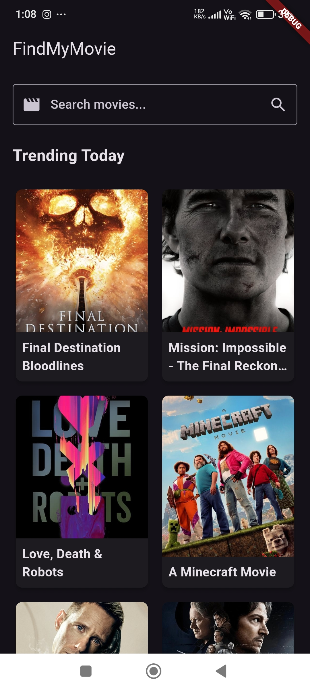
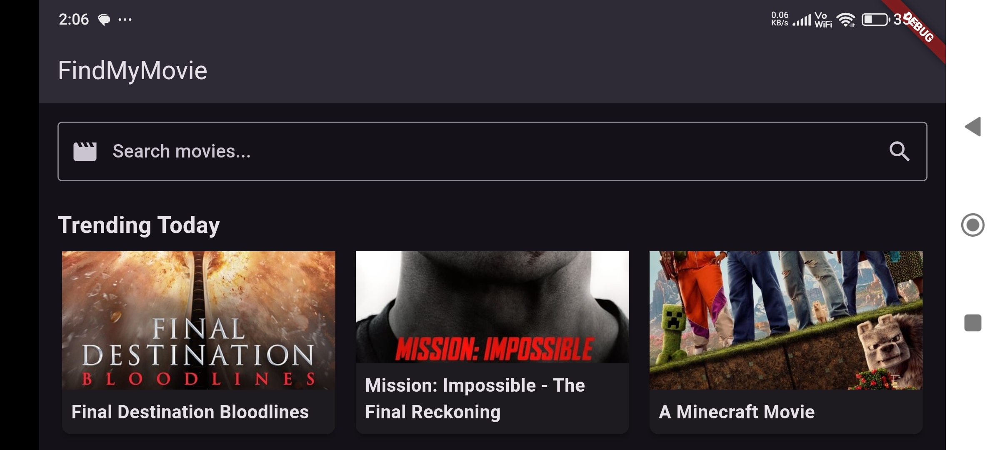
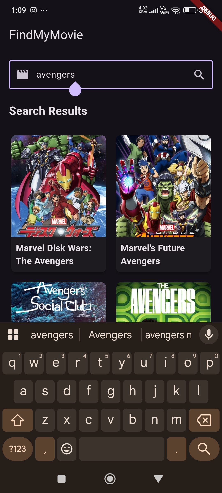
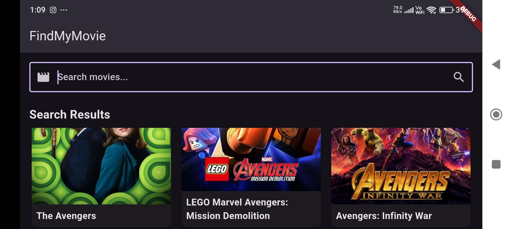
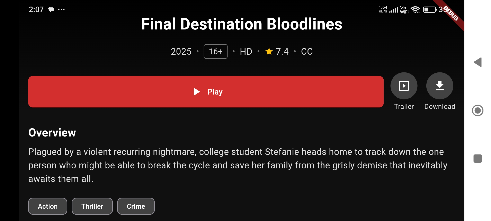

# 🎬 FindMyMovie — Discover Movies Like Never Before

[](https://github.com/vansh-121/FindMyMovie/actions)
[](LICENSE)
[](https://github.com/vansh-121/FindMyMovie/commits)
[](https://flutter.dev)
[](https://pub.dev/packages/flutter_bloc)

FindMyMovie is a sleek, responsive Flutter app that allows users to search for movies using the [TMDb API](https://www.themoviedb.org/documentation/api). It delivers fast and accurate results, displaying movie posters, titles, release dates, and brief overviews in a visually appealing interface.

> 🔍 Built with Flutter, BLoC/Cubit for state management, and incorporates API integration, error handling, and responsive UI.

---

## 🧪 Demo

### 📽️ Video Demo


https://github.com/user-attachments/assets/f0daeb32-d013-48c9-bc55-2ba00fba329c


### 🖼️ Screenshots

### 🏠 Home Screen
<p float="left">
  
  
</p>

### 🔍 Search Screen
<p float="left">
  
  
</p>

### 🎥 Movie Detail Screen
<p float="left">
  
  
</p>


---

## ✨ Features

- 🔍 **Search** movies by title using [TMDb API](https://www.themoviedb.org/documentation/api)
- ⚙️ **BLoC/Cubit** architecture for clean and scalable code
- 📱 Fully **responsive UI** across devices
- 🧩 **Error handling** for a smooth user experience
- 🌙 Light & Dark mode support (customizable)
- 📡 Optimized network handling

---

## 🚀 Getting Started

### 1. Clone the repo

```bash
git clone https://github.com/vansh-121/FindMyMovie.git
cd FindMyMovie
```

### 2.Install dependencies

```bash
flutter pub get
```

### 3. Add your TMDb API key

```bash
const String apiKey = 'your_api_key';
```
👉 Get your API key from TMDb Developer Portal


### 4. Run the app

```bash
flutter run
```


---


## Project Structure :-

```bash
lib/
├── bloc/            # BLoC & Cubit files
├── models/          # Data models
├── repository/      # API services and logic
├── screens/         # UI screens
├── widgets/         # Reusable widgets
└── main.dart        # Entry point
```
---

#### Made with ❤️ by Vansh
